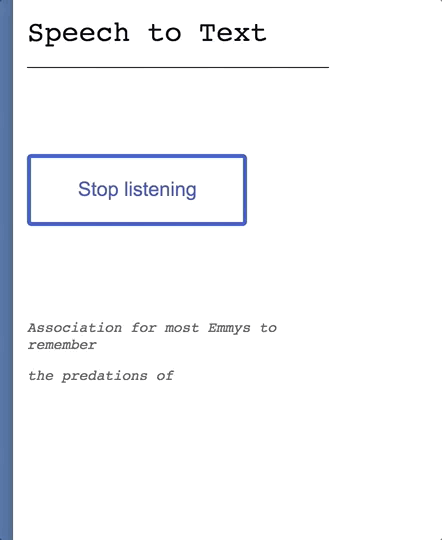

# audio-transcription



### Build and Run

Build and run with docker-compose

```docker-compose up --build```

Authenticate to the minio object storage server using the minio access key and secret key
specified by environment variables in the [docker-compose.yml](docker-compose.yml).
You should be able to access a minio UI at [http://localhost:8080](http://localhost:8080).


Or if you don't care about saving transcriptions, launch just the frontend directly [here](https://redwrasse.github.io/audio-transcription/), hosted on github pages.


